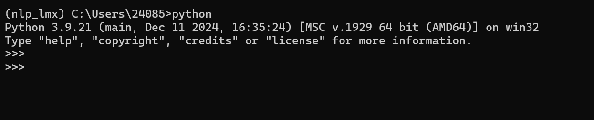
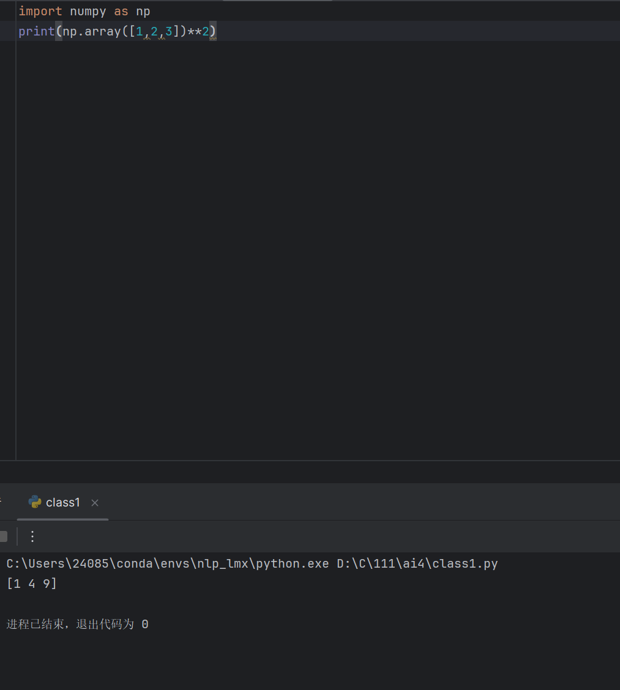

# 自我介绍


**大家好，我是懒羊羊**，我的身份是*小绵羊*。以下是我的自我介绍：

---

## 基础档案

### 外貌特征
- 冰激凌发型
- 黄色肚兜

## 我的好朋友
1. 喜羊羊
2. 灰太狼
3. ~~沸羊羊~~

### 重要坐标
- 住址：[青青草原](https://baike.baidu.com/item/%E9%9D%92%E9%9D%92%E8%8D%89%E5%8E%9F/18834)
- 工作单位：[羊村](https://baike.baidu.com/item/%E7%BE%8A%E6%9D%91/70871)
### 日常作息表
|  时间   | 活动 |
|:-----:|----|
| 8：00  | 吃饭 |
| 9：00  | 睡觉 |
| 12：00 | 吃饭 |
| 13：00 | 睡觉 |
| 18：00 | 吃饭 |

### 人生信条
> 天大地大吃饭最大

---

## 我的专业是人工智能

## 我最喜欢的一段代码
```python
def main():
    print("Wow delicious!")

if __name__ == "__main__":
    main()
```
其中执行 python dev_skills_env.py 可输出结果。


我最喜欢的环境管理工具是conda



我可以在IDE上使用我建立的虚拟环境

